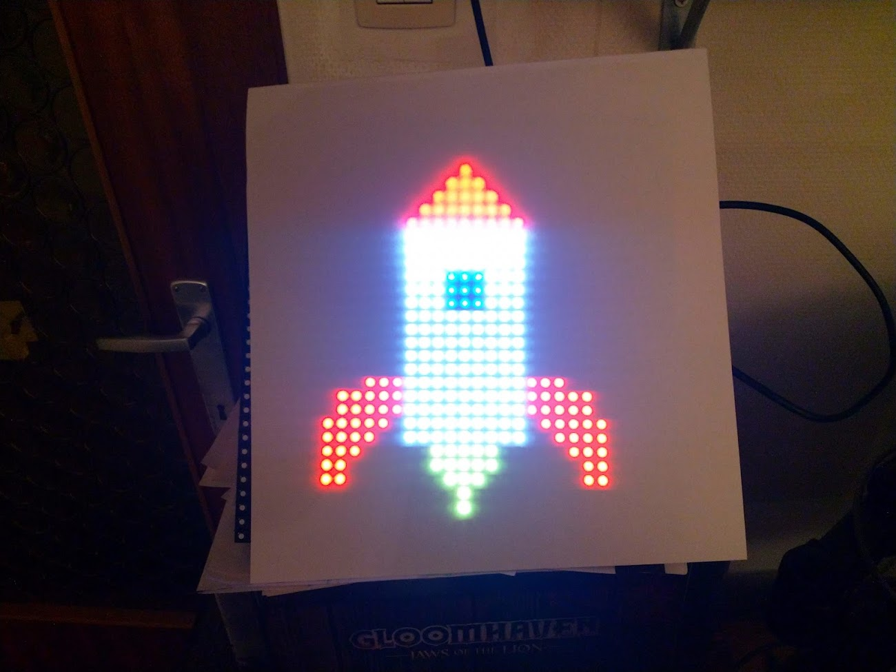

# RGB Led Panel Controller

This project contains a generic controller firmware for an AdaFruit 32x32 LED matrix. 

The panel itself is connected to a K64F board that runs a generic display controller. The idea was to allow the user to ontrol the 32x32 AdaFruit LED panel from the following interfaces:

- [ ] TCP Socket
- [ ] UDP Socket
- [ ] I2C Interface
- [X] Serial Port
- [ ] SPI Interface

These interfaces allow 2 modes of control.

1. RAW RGB data frame mode where one can just send a full RGB buffer to the interface, which is then transfered to the panel buffer and displayed.
2. A canvas mode where it is possible to draw on a canvas and then transfer that to the panel.

The canvas mode supports a number of actions:

1. clear: clearing the canvas
2. pixel: setting the color of a single pixel at coordinates x,y
3. h-line: horizontal line in a specific color
4. v-line: vertical line in a specific color

A possible future enhancement could be a `static` action that allows you to draw a static pixel map and save that. After which each clear would clear the canvas except for the static image.

## Hardware

* [32x32 RGB LED Matrix Panel](https://www.adafruit.com/product/607)
* [FRDM-K64F](https://os.mbed.com/platforms/FRDM-K64F/)

### Connections

TODO

## Serial Port

Currently the controller only supports command mode via the serial interface. An example can be found in the `js-controller` application which allows the user to draw pixelart on the led panel.



### Command Parser

Command parser is copy of Sille's command parser for DUST. Maybe later it could become a library :). Thx mate. Works as a charm.

### PixelArt Setup - JavaScript Controller

The javascript controller code is a small demonstration application on how to interface with the generic controller over a serial interface by sending commands to the display controller. It allows the user to draw PixelArt on the display.

#### Keyboard Controller Hosting

A Raspberry Pi 400 is recommended for a PixelArt setup. Just flash a default Raspbian 64 bit desktop OS and connect the K64 via USB to the Raspberry Pi.

Install NodeJs v19:

```bash
curl -fsSL https://deb.nodesource.com/setup_19.x | sudo -E bash - &&\
sudo apt-get install -y nodejs
```

Clone the repo:

```bash
git clone https://github.com/BioBoost/mbed-generic-rgb-panel-controller-pixelart
```

Install the dependencies

```bash
cd mbed-generic-rgb-panel-controller-pixelart
npm install
```

Start the javascript controller

```bash
npm start
```

Use the following keys:

* arrow-keys: move the cursor
* space: draw pixel
* c: change color
* esc: clear the screen (blank)
* r: reset (shows rocket)
* d: drag mode (keep drawing while moving)
* s: save

## QR-Code

TODO